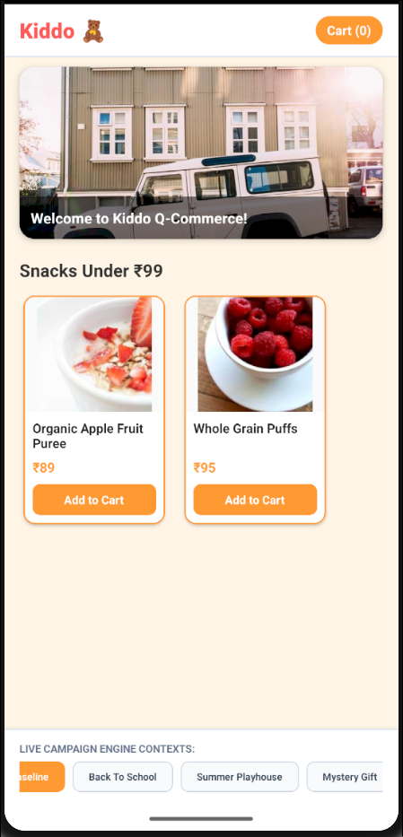
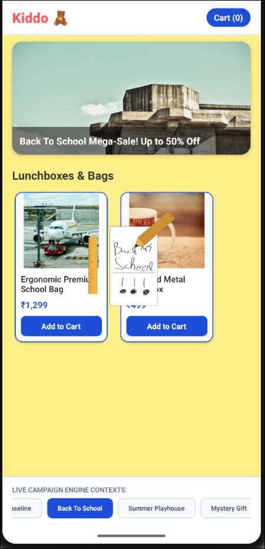
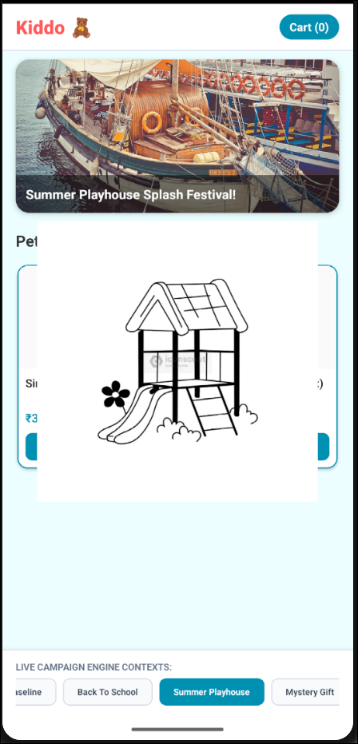
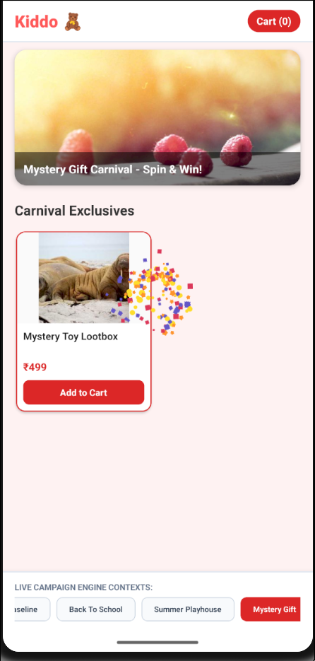

# 🚀 Kiddo Server-Driven UI (SDUI) Homepage Engine

A high-performance, configuration-driven, and resilient **Server-Driven UI (SDUI)** homepage rendering engine built with **React Native (Expo)** and **TypeScript**.

The application functions as a declarative rendering engine that consumes structured JSON payloads, dynamically resolves layouts through a component registry, maps interactions through a centralized action dispatcher, and maintains smooth rendering performance using optimized virtualization and selective state subscriptions.

---

## ✨ Highlights

* ⚡ Dynamic server-driven UI rendering
* 🧩 Scalable component registry architecture
* 🎯 Centralized action dispatching
* 🔒 Strict TypeScript typing and contracts
* 🚀 Optimized rendering performance with Zustand + React.memo
* 🛡️ Fault-tolerant rendering pipeline
* 🎨 Theme-driven UI configuration
* 📱 Production-ready React Native architecture

---

## Screenshots
<p align="center">
  <a href="assets/image.png" title="Back To School campaign screen (click to zoom)">
    
  </a>
  <a href="assets/image-1.png" title="Summer Playhouse campaign screen (click to zoom)">
    
  </a>
  <a href="assets/image-2.png" title="Mystery Gift campaign screen (click to zoom)">
    
  </a>
  <a href="assets/image-3.png" title="Baseline campaign screen (click to zoom)">
    
  </a>
</p>

# Architecture Overview

The application follows an asynchronous unidirectional rendering flow where layouts, themes, and interactions are completely driven by backend payloads.

```text
  [Backend Payload JSON]
         │
         ▼
 ┌──────────────────────────────┐
 │     HomepageRenderer         │ ◄── Theme Provider
 └──────────────┬───────────────┘
                │
                ▼
 ┌──────────────────────────────┐
 │     Component Registry       │
 └──────────────┬───────────────┘
                │
                ▼
 ┌──────────────────────────────┐
 │   Atomic React.memo Nodes    │ ◄── Zustand Store
 └──────────────┬───────────────┘
                │
                ▼
 ┌──────────────────────────────┐
 │  Universal Action Dispatcher │
 └──────────────────────────────┘
```

---

# Candidate Evaluation Criteria Mapping

## 1. Architectural Cleanliness & Component Registry

To ensure long-term scalability and maintainability, the renderer avoids large conditional rendering blocks and instead implements a decoupled component factory architecture.

### Key Decisions

* Dynamic runtime component registration
* Factory pattern-based component resolution
* Independent, reusable UI blocks
* Single registration lifecycle at app startup

### Component Registry

```ts
class ComponentRegistry {
  private registry = new Map<string, SDUIComponentType>();

  register(type: string, component: SDUIComponentType) {
    this.registry.set(type, component);
  }

  get(type: string): SDUIComponentType | undefined {
    return this.registry.get(type);
  }
}
```

### Benefits

* Easy introduction of new server-driven components
* No renderer modifications required for new layouts
* Strong separation of concerns
* Highly maintainable architecture

---

## 2. Sustained Frame Performance

The homepage renderer is optimized to maintain smooth scrolling and interaction performance under heavy UI loads.

### Selective State Subscriptions

The cart state is managed using **Zustand selectors**, ensuring only affected product cards re-render when quantities change.

Benefits:

* Prevents unnecessary tree-wide re-renders
* Improves responsiveness
* Reduces reconciliation overhead

### Virtualized Rendering

The homepage feed leverages optimized FlatList configurations:

```tsx
removeClippedSubviews={true}
initialNumToRender={5}
maxToRenderPerBatch={5}
windowSize={7}
```

This ensures:

* Lower memory consumption
* Faster mount times
* Efficient rendering of large layouts

### Nested Scroll Optimization

Horizontal collections use:

```tsx
nestedScrollEnabled
```

to preserve momentum and prevent Android scroll conflicts.

### Overlay Lifecycle Management

Campaign overlays:

* Auto-dismiss after completion
* Fully unmount from the React tree
* Eliminate background CPU/GPU work

---

## 3. TypeScript Strategy

The project is developed using strict TypeScript mode to maximize reliability and maintainability.

### Action Contracts

```ts
export type ActionType =
  | 'ADD_TO_CART'
  | 'DEEP_LINK'
  | 'APPLY_MYSTERY_GIFT_COUPON';
```

### Strongly Typed Actions

```ts
export interface SDUIAction {
  type: ActionType;
  payload: {
    id?: string;
    url?: string;
    couponCode?: string;
    [key: string]: any;
  };
}
```

### Benefits

* Compile-time validation
* Safer payload handling
* Predictable interaction contracts
* Reduced runtime errors

---

## 4. System Resilience & Fault Isolation

The renderer prioritizes application stability when processing malformed or evolving backend payloads.

### Graceful Layout Rejection

Unknown component types are safely ignored:

```json
{
  "type": "NEW_COMPONENT_V2"
}
```

Instead of crashing:

* A development warning is logged
* The node is skipped
* Rendering continues uninterrupted

### Offline-First Asset Strategy

Lottie animations are bundled locally:

```ts
require('../assets/mystery-gift.json')
```

Benefits:

* No external dependency failures
* No CDN-related rendering issues
* Consistent offline experience

### Interaction Transparency

Overlays use:

```tsx
pointerEvents="none"
```

allowing users to:

* Continue scrolling
* Interact with products
* Use buttons beneath active animations

without interruption.

---

# Project Structure

```text
src/
├── actions/
│   └── ActionDispatcher.ts
│
├── assets/
│   ├── back-to-school.json
│   ├── mystery-gift.json
│   └── summer-playhouse.json
│
├── components/
│   ├── BannerHero.tsx
│   ├── CampaignOverlay.tsx
│   ├── DynamicCollection.tsx
│   ├── ProductCard.tsx
│   └── ProductGrid2x2.tsx
│
├── context/
│   └── ThemeContext.tsx
│
├── mocks/
│   └── sduiPayload.ts
│
├── registry/
│   └── ComponentRegistry.ts
│
├── screens/
│   └── HomepageRenderer.tsx
│
├── state/
│   ├── campaignStore.ts
│   └── cartStore.ts
│
└── types/
    └── sdui.types.ts
```

---

# Getting Started

## Prerequisites

* Node.js (LTS)
* npm or Yarn
* Android Studio / Android Emulator
* Expo CLI

---

## Installation

```bash
npm install
```

---

## Android SDK Configuration (Linux)

Add the following to your shell profile:

```bash
export ANDROID_HOME=$HOME/Android/Sdk
export PATH=$PATH:$ANDROID_HOME/emulator
export PATH=$PATH:$ANDROID_HOME/platform-tools
```

Apply changes:

```bash
source ~/.zshrc
```

---

## Run the Project

Start Expo:

```bash
npx expo start
```

Useful shortcuts:

| Key | Action                  |
| --- | ----------------------- |
| a   | Launch Android Emulator |
| r   | Reload Metro Bundler    |

---

# Technical Stack

* React Native
* Expo
* TypeScript
* Zustand
* FlatList Virtualization
* Lottie Animations
* Context API

---

# Design Goals

This project was built with the following engineering principles:

* Scalability
* Performance
* Fault Tolerance
* Maintainability
* Type Safety
* Extensibility

The goal is to demonstrate how a production-grade Server-Driven UI platform can dynamically evolve through backend configuration while preserving native application performance and stability.

---

## ❤️ Made with love by [Saksham](https://github.com/0xsaksham)
